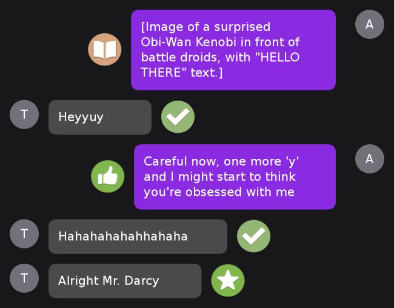
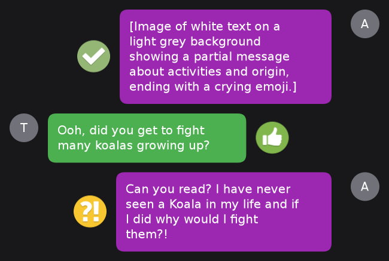
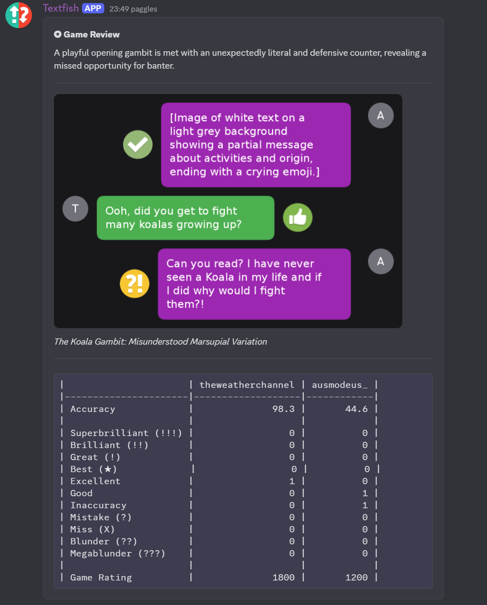

# Textfish


`textfish` is a bot that analyses texting interactions using chess terms and icons using AI. The name is a parody of the software "Stockfish".

`textfish` analyzes images of text conversations, generates a stylized review image, and posts a detailed "Game Review" message. It leverages Google Gemini for AI analysis and a custom renderer for visuals.

## Examples

### Example 1: Rendered Annotation



_Above: A sample output image generated by the bot's renderer._

### Example 2: Full Flow

| Step                           | Screenshot                                 |
| ------------------------------ | ------------------------------------------ |
| a. Original Hinge conversation |   |
| b. Rendered image              |  |
| c. Bot's Discord reply         |       |

---

## Getting Started

### Prerequisities

- npm

```sh
npm install npm@latest -g
```

### Installation

1. Clone the repo

    ```sh
    git clone https://github.com/WetaLabs/Textfish.git
    ```

2. Install NPM packages
    ```sh
    npm install
    ```
3. Create a .env with the follwing info
    ```sh
    GEMINI_API_KEY=YOUR_TOKEN
    DISCORD_TOKEN=YOUR_TOKEN
    APPID_TH=YOUR_APPID
    ```

## Credits
Original idea & implementation `u/pjpuzzler` & `r/textingtheory`

## Contributing

Contributions are what make the open source community such an amazing place to learn, inspire, and create. Any contributions you make are **greatly appreciated**.

If you have a suggestion that would make this better, please fork the repo and create a pull request. You can also simply open an issue with the tag "enhancement".
Don't forget to give the project a star! Thanks again!

1. Fork the Project
2. Create your Feature Branch (`git checkout -b feature/AmazingFeature`)
3. Commit your Changes (`git commit -m 'Add some AmazingFeature'`)
4. Push to the Branch (`git push origin feature/AmazingFeature`)
5. Open a Pull Request

## License


Distributed under the MIT License. See `LICENSE.txt` for more information.
