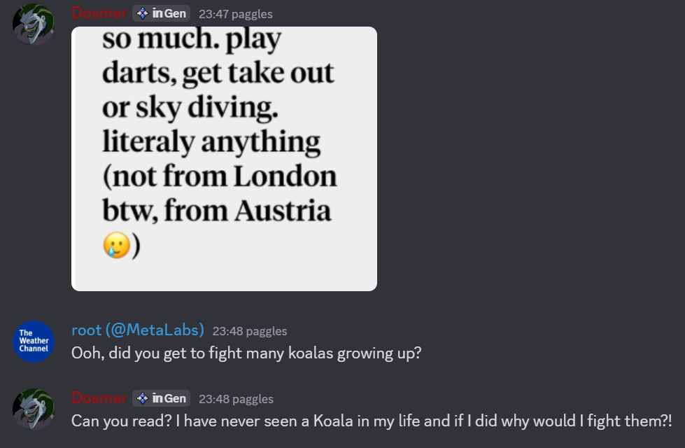

# Textfish

`textfish` is a bot that analyses texting interactions using chess terms and icons using AI. The name is a parody of the software "Stockfish". 

`textfish`  analyzes images of text conversations, generates a stylized review image, and posts a detailed "Game Review" comment. It leverages Google Gemini for AI analysis and a custom renderer for visuals.

## Examples

### Example 1: Rendered Annotation

*Above: A sample output image generated by the bot's renderer.*

### Example 2: Full Flow

| Step                           | Screenshot                                 |
| ------------------------------ | ------------------------------------------ |
| a. Original Hinge conversation |   |
| b. Rendered image              |  |
| c. Bot's Discord reply         |       |

---